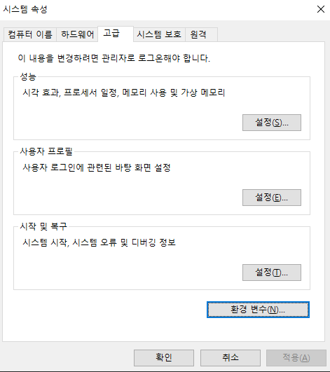

# 윈도우 개발환경 설정

## 1. WSL2 설치

PowerShell을 열고 아래와 같이 입력한다.

```powershell
wsl --install
wsl --set-default-version 2
```

이제 WSL을 통해 Linux 배포판을 설치한다.

아래 명령어를 통해 WSL 온라인으로 설치할 수 있는 배포판 목록을 확인할 수 있다.

```poweershell
wsl -l --online
# ...
# NAME                                   FRIENDLY NAME
# ...
# Ubuntu-22.04                           Ubuntu 22.04 LTS
# Ubuntu-24.04                           Ubuntu 24.04 LTS
# ...
```

위 목록 중 `Ubuntu-24.04` 배포판을 설치한다.

```powershell
# wsl --install -d <Linux 배포판 이름>
wsl --install -d Ubuntu-24.04
```

</br>

## 2. Chocolatey 설치

MacOS에 [`brew`](https://brew.sh/ko/)가 있다면 Windows에는 [`choco`](https://chocolatey.org/)가 있다.

- [Chocolatey Official - Setup / Install](https://docs.chocolatey.org/en-us/choco/setup/)

PowerShell을 `관리자` 모드로 열고 아래와 같이 입력한다.

```powershell
# 명령어가 길어서 여러줄 같아 보이지만 한줄이다. 그대로 복붙한다.
Set-ExecutionPolicy Bypass -Scope Process -Force; [System.Net.ServicePointManager]::SecurityProtocol = [System.Net.ServicePointManager]::SecurityProtocol -bor 3072; iex ((New-Object System.Net.WebClient).DownloadString('https://community.chocolatey.org/install.ps1'))
```

설치가 잘 되었는지 다음과 같이 확인해보자

```powershell
choco --version
# 2.3.0
```

이후에 Chocolatey를 사용할 때도, `관리자`모드로 PowerShell을 열어 사용해야 한다.

</br>

## 3. Docker Desktop 설치

아래 명령어를 통해 설치하거나 [직접 다운로드](https://docs.docker.com/desktop/install/windows-install/)하여 설치한다.

```powershell
# 관리자 모드에서 수행
choco install docker-desktop
```

설치 후 Docker Desktop을 열고 `Settings > General`에 있는 아래 옵션을 활성화 한다


</br>

## 4. VSCode 설치

아래 명령어를 통해 설치하거나 [직접 다운로드](https://code.visualstudio.com/download)하여 설치한다.

(직접 다운로드하여 설치 시 `PATH에 추가` 옵션을 반드시 체크해 준다)

```powershell
# 관리자 모드에서 수행
choco install vscode
```

터미널에서 VSCode를 여는 방법은 아래와 같다.

```bash
# code <경로>
code .
```

이는 VSCode를 설치할 때 `PATH에 추가` 옵션을 체크하여 설치하거나 직접 VSCode PATH를 환경변수로 추가해 줬을때 가능하다.

만약 설치과정에서 놓쳤다면 아래와 같이 추가할 수 있다.

1. `Win` + `I` 를 눌러 설정을 열고 `시스템 환경 변수 편집`(띄어쓰기 주의)을 검색하여 들어간다.
1. 사진과 같은 화면에서 `환경변수(N)...`를 선택한다

   

1. `시스템 변수` 항목에서 스크롤을 내려가며 Path를 찾아 `더블클릭`하여 들어간다.
1. `새로 만들기`를 클릭 후 아래의 경로를 입력한 뒤 `확인`을 눌러 빠져나온다.

   ```PowerShell
   C:\Program Files\Microsoft VS Code\bin
   ```

</br>

## 5. WSL에서 VSCode 열기

WSL에서 개발을 시작하려면 WSL에서 VSCode를 열어야 한다.

우선 Powershell에서 아래 명령어를 통해 설치한 WSL 배포판을 실행한다.

```powershell
# 설치된 WSL 배포판 목록 확인.
wsl --list --all

# 배포판 실행
# => wsl -d <배포판 이름> --cd <디렉토리> -- <전달할 명령어>
wsl -d Ubuntu-24.04 --cd ~ -- code .
```

</br>

## 6. WSL 환경설정

`5.` 과정을 통해 WSL 환경에 진입하였다.

그 상태로 아래의 문서를 통해 WSL 내부 환경설정을 완료한다.

- [WSL Ubuntu Setup](./wsl-ubuntu-setup.md)
